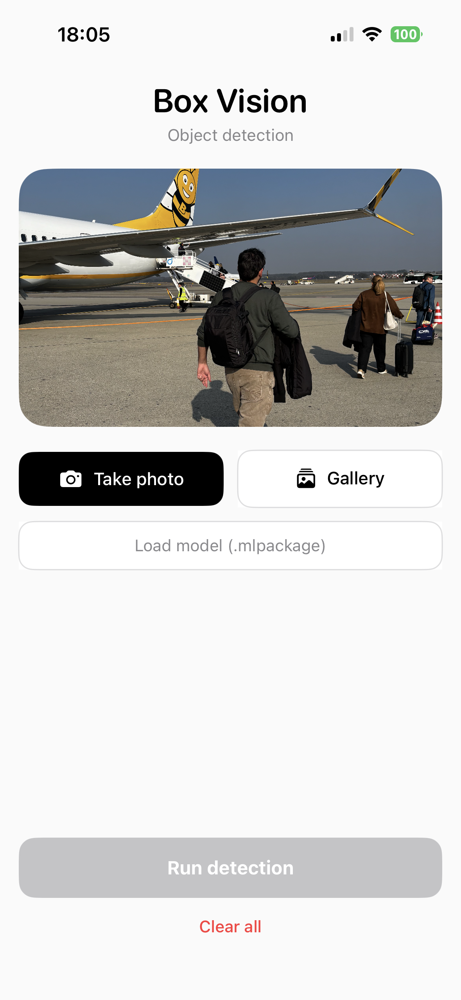
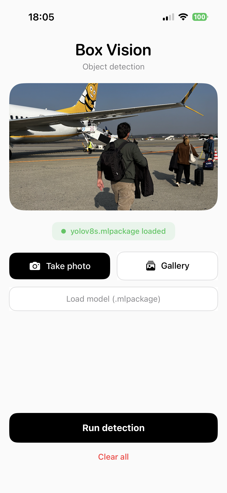

# BoxVision

BoxVision is an iOS application built with SwiftUI that performs on-device object detection using CoreML models. It allows users to select or capture images, load custom YOLO-based models, and visualize detection results with bounding boxes, labels, and confidence scores.

## Features

- Capture images using the camera  
- Select images from the photo library  
- Load custom CoreML models (.mlmodel / .mlpackage)  
- Run object detection directly on-device  
- Visualize bounding boxes with labels and confidence scores  
- Smooth SwiftUI navigation and transitions  
- Fully offline inference (no backend required)  

## Screenshots

| Home | Model Selection | Results |
|------|----------------|--------|
|  |  |  |

## Tech Stack

- SwiftUI  
- CoreML  
- Vision Framework  
- PhotosUI  
- UIKit (camera integration)  
- YOLOv8 (converted to CoreML)  

## Architecture

The app follows a simple MVVM-inspired structure:

- Views  
  - ContentView → Main interface  
  - ResultsView → Displays detection results  
- ViewModel  
  - ModelViewModel → Handles model loading and inference  
- Models  
  - Detection → Represents detected objects  
- Utilities  
  - Bounding box rendering and coordinate conversion  

## Requirements

- iOS 16+  
- Xcode 15+  
- A CoreML-compatible object detection model (.mlmodel / .mlpackage)  

## How It Works

1. User selects or captures an image  
2. A CoreML model is loaded into the app  
3. Vision framework runs inference on the image  
4. Results are parsed into detections  
5. Bounding boxes are rendered over the image in SwiftUI  

## Model Support

BoxVision supports CoreML models exported from YOLO (e.g., YOLOv8 via Ultralytics).

- Models must be compatible with Vision  
- Recommended export format: .mlpackage  
- Detection outputs are mapped to bounding boxes, labels, and confidence scores  

## Installation & Run

1. Clone the repository:

git clone https://github.com/francescodepatre/BoxVision.git

2. Open the project in Xcode:

BoxVision.xcodeproj

3. Add your CoreML model to the project (if not included)

4. Select a simulator or a physical iOS device

5. Build and run:

⌘ + R

## Usage

- Launch the app  
- Select or capture an image  
- Load a CoreML model  
- Tap Run Model  
- View detection results with bounding boxes  

## Notes

- .mlpackage must be imported using the file importer  
- Models must be properly exported from YOLO to CoreML  
- Some models may require compatibility adjustments with Vision  
- Runs fully offline on-device  

## Future Improvements

- Real-time camera object detection  
- Multi-model switching  
- Detection history and saving results  
- Export detections (JSON/CSV)  
- Performance metrics (inference time, FPS)  
- Model benchmarking tools  

## Author

Francesco De Patre
